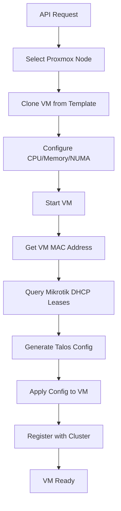

# Proxmox Talos VM Deployer

> **⚠️ Mikrotik Dependency**
> This deployer requires a Mikrotik router as DHCP server for IP discovery. The qemu-guest-agent approach creates a deadlock: the agent only starts after VM provisioning, but we need the IP before provisioning completes. Mikrotik's DHCP lease API solves this by querying leases via MAC address.
>
> If you know alternative solutions for reliable IP discovery during VM bootstrap, or have ideas on fixing the qemu-guest-agent issue, please feel free to reach out!

An HTTP service that automates Talos Linux VM deployment on Proxmox VE and seamlessly registers them with existing Talos Kubernetes clusters.

## Overview

This tool streamlines the process of creating and managing Talos Linux VMs by:
- **Automated VM Creation**: Clones from templates with configurable CPU, memory, and disk settings
- **Smart Node Selection**: Uses weighted algorithms to distribute VMs across Proxmox nodes
- **NUMA & CPU Affinity**: Optimizes performance with proper NUMA topology and core pinning
- **Cluster Integration**: Automatically registers new nodes with existing Talos clusters
- **IP Discovery**: Uses Mikrotik DHCP leases for reliable VM IP detection
- **Bulk Operations**: Create multiple VMs in a single API call

## Prerequisites

- **Proxmox VE** cluster with Talos Linux template
- **Mikrotik router** configured as DHCP server with REST API enabled
- **Existing Talos cluster** or control plane
- **talosctl** installed ([quick install](https://talos.dev/install): `curl -sL https://talos.dev/install | sh`)

## Quick Start

### Using Docker (Recommended)

```bash
docker run -p 8080:8080 \
  -e LISTEN_ADDR="0.0.0.0" \
  -e LISTEN_PORT="8080" \
  -e CONFIG_PATH="/app/config.yaml" \
  -e PROXMOX_BASE_ADDR="https://your-proxmox.example.com:8006/api2/json" \
  -e PROXMOX_TOKEN="user@pve!token=your-token-here" \
  -e AUTH_TOKEN="your-api-auth-token" \
  -e SENTRY_DSN="http://foobar@127.0.0.1:1234/1" \
  -e TALOS_CONTROLPLANE_ENDPOINT="https://your-controlplane:6443" \
  -e MIKROTIK_IP="10.100.0.1" \
  -e MIKROTIK_USERNAME="admin" \
  -e MIKROTIK_PASSWORD="your-password" \
  -v $(pwd)/config.yaml:/app/config.yaml \
  -v $(pwd)/talos-machine-config.yaml:/app/talos-machine-config.yaml \
  ghcr.io/d13410n3/proxmox-talos-vm-deployer:latest
```

### Create Your First VM

```bash
curl -X POST http://localhost:8080/api/v1/create \
  -H "X-Auth-Token: your-auth-token" \
  -d "base_template=talos-template" \
  -d "vm_template=talos-worker-small"
```

## Configuration

### Environment Variables

#### Required
- `PROXMOX_BASE_ADDR`: Proxmox VE API base URL (e.g., `https://proxmox.example.com:8006/api2/json`)
- `PROXMOX_TOKEN`: Proxmox VE API token (format: `user@realm!tokenname=token-value`)
- `AUTH_TOKEN`: Authentication token for API access
- `TALOS_MACHINE_TEMPLATE`: Path to Talos machine configuration template
- `TALOS_CONTROLPLANE_ENDPOINT`: Talos control plane endpoint
- `MIKROTIK_IP`: Mikrotik router IP address for DHCP lease queries
- `MIKROTIK_USERNAME`: Mikrotik API username
- `MIKROTIK_PASSWORD`: Mikrotik API password
- `SENTRY_DSN`: Sentry DSN for error tracking (use `http://foobar@127.0.0.1:1234/1` if no Sentry)

#### Optional
- `LISTEN_ADDR`: HTTP server listen address (default: `0.0.0.0`)
- `LISTEN_PORT`: HTTP server listen port (default: `8080`)
- `CONFIG_PATH`: Path to YAML configuration file (default: `config.yaml`)
- `MIKROTIK_PORT`: Mikrotik REST API port (default: `8080`)
- `DEBUG`: Enable debug mode (default: `false`)
- `LOG_LEVEL`: Log level - 0: Debug, 1: Info, 2: Error (default: `1`)
- `VERIFY_SSL`: Verify SSL certificates (default: `true`)

### Configuration File (config.yaml)

The service uses a YAML configuration file to define nodes and VM templates:

```yaml
nodes:
  - name: proxmox-node1       # Name of the node
    weight: 10                # Weight of the node (higher weight means more VMs)
    suffix: "1"               # Suffix for VM names, i.e. talos-worker-small-<suffix>-<....>
    ht: true                  # Is Hyperthreading enabled. Used for CPU allocation
    hugepages: false          # Is hugepages enabled. Used for memory allocation
    numa:                     # Host node NUMA topology. Check yours with numactl --hardware
      - id: 0                 # NUMA node id
        cores:
          phy: 0-15           # Physical cores of NUMA node 0
          ht: 32-47           # Hyperthreaded cores of NUMA node 0
      - id: 1
        cores:
          phy: 16-31
          ht: 48-63
    base_templates:           # Proxmox templates to use for VM creation
      - name: talos-template  # Name (used in "base_template" parameter in deploy)
        id: 1901              # Actual template VM id

vm_templates:
  - name: talos-worker-small  # Template name (used in "vm_template" parameter in deploy)
    cpu: 4                    # Number of cores
    memory: 8192              # Memory
    disk: 20                  # Boot disk size
    cpu_model: kvm64          # CPU model to set
    role: worker              # Role, will be used in machine configuration template
  - name: talos-worker-medium
    cpu: 8
    memory: 16384
    disk: 50
    cpu_model: kvm64
    role: worker
  - name: talos-controlplane
    cpu: 4
    memory: 8192
    disk: 30
    cpu_model: kvm64
    role: controlplane
```

### Talos Machine Configuration Template

Create a Talos machine configuration template with placeholders that will be automatically replaced during VM creation:

```yaml
version: v1alpha1
debug: false
persist: true
machine:
    type: {role}
    token: your-machine-token-here
    ca:
        crt: LS0tLS1CRUdJTi0tLS0t  # Your cluster CA certificate
    network:
        hostname: {vm_name}
    install:
        disk: /dev/vda
        image: factory.talos.dev/installer/your-installer-id:v1.10.6
    sysctls:
        net.core.somaxconn: 65535
        net.core.netdev_max_backlog: 4096
    nodeLabels:
        talos.dev/worker: ""
        node-role.kubernetes.io/worker: ""
        topology.kubernetes.io/zone: home-{suffix}
cluster:
    id: your-cluster-id-here
    secret: your-cluster-secret-here
    controlPlane:
        endpoint: https://your-controlplane:6443
    clusterName: your-cluster-name
    network:
        dnsDomain: cluster.local
        podSubnets:
            - 10.244.0.0/16
        serviceSubnets:
            - 10.96.0.0/12
    token: your-cluster-token-here
    ca:
        crt: LS0tLS1CRUdJTi0tLS0t  # Your cluster CA certificate
```

#### Available Placeholders

| Placeholder | Description | Example |
|-------------|-------------|---------|
| `{role}` | VM template role | `worker`, `controlplane` |
| `{vm_name}` | Generated or specified VM name | `talos-worker-small-1-abc123` |
| `{node}` | Proxmox node name | `proxmox-node1` |
| `{vm_template}` | VM template name | `talos-worker-small` |
| `{cpu}` | CPU model | `kvm64`, `host` |
| `{cpu_cores}` | Number of CPU cores | `4`, `8` |
| `{memory}` | Memory in MB | `8192` |
| `{disk}` | Disk size in GB | `20`, `50` |
| `{suffix}` | Node suffix from config | `1`, `2` |

## API Reference

### Create VM

**POST** `/api/v1/create`

Creates and configures a new Talos VM, then registers it with the cluster.

**Headers:**
- `X-Auth-Token`: Your authentication token

**Parameters:**
- `base_template` *(required)*: Proxmox template name to clone from
- `vm_template` *(required)*: VM configuration template name
- `name` *(optional)*: Custom VM name (auto-generated if not provided)
- `node` *(optional)*: Target Proxmox node (auto-selected by weight if not provided)
- `count` *(optional)*: Number of VMs to create for bulk operations
- `reset` *(optional)*: Reset VM after creation (`"1"` to enable)

**Advanced CPU/NUMA Options:**
- `numa` *(optional)*: Specific NUMA node ID
- `phy` *(optional)*: Physical cores to pin (e.g., `"0-3,8-11"`)
- `ht` *(optional)*: Hyperthreaded cores to pin (e.g., `"32-35,40-43"`)
- `phy_only` *(optional)*: Use only physical cores (`"1"` to enable)
- `ht_only` *(optional)*: Use only hyperthreaded cores (`"1"` to enable)

**Response:**
```json
{
  "vm_id": 12345,
  "node": "proxmox-node1",
  "name": "talos-worker-small-1-12345-abc123",
  "ip": "192.168.88.175",
  "role": "worker",
  "reset": false,
  "duration_seconds": 127.45
}
```

### Delete VM

**POST** `/api/v1/delete`

**Headers:**
- `X-Auth-Token`: Your authentication token

**Parameters:**
- `vm_name` *(optional)*: VM name to delete
- `node` + `vm_id` *(optional)*: Alternative to vm_name
- `stop_method` *(optional)*: `"shutdown"` or `"stop"` (default: `"shutdown"`)

### Health & Monitoring

- **GET** `/health-check` - Service health status
- **GET** `/metrics` - Prometheus metrics

## Usage Examples

### Single VM Creation

```bash
# Create a worker node
curl -X POST http://localhost:8080/api/v1/create \
  -H "X-Auth-Token: your-auth-token" \
  -d "base_template=talos-template" \
  -d "vm_template=talos-worker-small"

# Create a control plane node
curl -X POST http://localhost:8080/api/v1/create \
  -H "X-Auth-Token: your-auth-token" \
  -d "base_template=talos-template" \
  -d "vm_template=talos-controlplane"
```

### Bulk VM Creation

```bash
# Create 3 worker nodes at once
curl -X POST http://localhost:8080/api/v1/create \
  -H "X-Auth-Token: your-auth-token" \
  -d "base_template=talos-template" \
  -d "vm_template=talos-worker-medium" \
  -d "count=3"
```

### Advanced CPU Pinning

```bash
# Pin to specific physical cores
curl -X POST http://localhost:8080/api/v1/create \
  -H "X-Auth-Token: your-auth-token" \
  -d "base_template=talos-template" \
  -d "vm_template=talos-worker-small" \
  -d "phy=0-3,8-11" \
  -d "numa=0"
```

### VM Deletion

```bash
# Delete by VM name
curl -X POST http://localhost:8080/api/v1/delete \
  -H "X-Auth-Token: your-auth-token" \
  -d "vm_name=talos-worker-small-1-12345-abc123"
```

## Installation & Deployment

### Docker (Recommended)

#### Pre-built Image (linux/amd64)

```bash
docker run -p 8080:8080 \
  -e LISTEN_ADDR="0.0.0.0" \
  -e LISTEN_PORT="8080" \
  -e CONFIG_PATH="/app/config.yaml" \
  -e PROXMOX_BASE_ADDR="https://your-proxmox.example.com:8006/api2/json" \
  -e PROXMOX_TOKEN="user@pve!token=your-token-here" \
  -e AUTH_TOKEN="your-api-auth-token" \
  -e SENTRY_DSN="your-sentry-dsn" \
  -e TALOS_CONTROLPLANE_ENDPOINT="https://your-controlplane:6443" \
  -e TALOS_MACHINE_TEMPLATE="/app/talos-machine-config.yaml" \
  -e MIKROTIK_IP="10.100.0.1" \
  -e MIKROTIK_PORT="8080" \
  -e MIKROTIK_USERNAME="admin" \
  -e MIKROTIK_PASSWORD="your-password" \
  -e DEBUG="true" \
  -e LOG_LEVEL="0" \
  -e VERIFY_SSL="false" \
  -v $(pwd)/config.yaml:/app/config.yaml \
  -v $(pwd)/talos-machine-config.yaml:/app/talos-machine-config.yaml \
  ghcr.io/d13410n3/proxmox-talos-vm-deployer:latest
```

#### Build from Source

```bash
docker build -t proxmox-talos-vm-deployer .
docker run -p 8080:8080 \
  -e PROXMOX_BASE_ADDR="https://your-proxmox.example.com:8006/api2/json" \
  # ... other environment variables ...
  -v $(pwd)/config.yaml:/app/config.yaml \
  -v $(pwd)/talos-machine-config.yaml:/app/talos-machine-config.yaml \
  proxmox-talos-vm-deployer
```

### Native Binary

**Requirements:** Go 1.21+, talosctl

```bash
go mod tidy
go build -o proxmox-talos-vm-deployer
./proxmox-talos-vm-deployer
```


## Setup Guide

### 1. Proxmox Template Setup

Create a Talos Linux template in Proxmox:

1. **Download Talos ISO** from [Talos releases](https://github.com/siderolabs/talos/releases)
2. **Create VM** with desired specs (will be used as template)
3. **Install Talos** using the ISO
4. **Configure network** for DHCP
5. **Convert to template** in Proxmox

> **Note:** QEMU Guest Agent is not required and doesn't work properly with this setup.

### 2. Talos Cluster Preparation

- **Existing cluster** or control plane must be running
- **Install talosctl**: `curl -sL https://talos.dev/install | sh`
- **Machine config template** with proper cluster credentials

### 3. Mikrotik Router Configuration

```bash
# Enable REST API
/ip service set www-ssl disabled=no
/ip service set api disabled=no

# Create API user (optional, can use admin)
/user add name=api-user group=full password=your-password

# Ensure DHCP server is running
/ip dhcp-server print
```

## How It Works



**Process Details:**
1. **Node Selection** - Weighted algorithm chooses optimal Proxmox node
2. **VM Cloning** - Creates new VM from base Talos template
3. **Resource Configuration** - Sets CPU, memory, disk, NUMA topology
4. **Network Bootstrap** - Starts VM and waits for network initialization
5. **IP Discovery** - Queries Mikrotik DHCP leases using VM's MAC address
6. **Talos Configuration** - Generates machine config with replaced placeholders
7. **Cluster Integration** - Applies config and registers node with cluster

## Monitoring & Observability

### Prometheus Metrics

Available at `/metrics` endpoint:

| Metric | Description | Labels |
|--------|-------------|--------|
| `vm_deployer_vms_created_total` | Total VMs created | `node`, `base_template`, `vm_template` |
| `vm_deployer_vms_deleted_total` | Total VMs deleted | `node` |
| `vm_deployer_handler_errors_total` | Total handler errors | `handler` |

### Logging

- **LOG_LEVEL=0**: Debug (verbose output)
- **LOG_LEVEL=1**: Info (default)
- **LOG_LEVEL=2**: Error only

### Error Tracking

Sentry integration for error reporting and monitoring.

## Troubleshooting

### Common Issues

| Issue | Solution |
|-------|----------|
| **SSL Certificate Errors** | Set `VERIFY_SSL=false` for self-signed certificates |
| **Proxmox API Permissions** | Ensure token has VM management permissions |
| **Network Connectivity** | Verify VMs can reach Talos control plane |
| **IP Discovery Fails** | Check Mikrotik API connectivity and DHCP server |
| **Talos Registration Fails** | Validate machine config template and cluster credentials |

### Debug Steps

1. **Enable Debug Logging**
   ```bash
   export LOG_LEVEL=0
   export DEBUG=true
   ```

2. **Test Mikrotik Connectivity**
   ```bash
   curl -u admin:password http://mikrotik-ip:8080/rest/ip/dhcp-server/lease
   ```

3. **Verify Talos Config**
   ```bash
   talosctl validate --config your-machine-config.yaml
   ```

4. **Check VM Network**
   ```bash
   # From Proxmox node
   qm guest cmd <vmid> network-get-interfaces
   ```

### Support

- **Logs**: Check service logs with `LOG_LEVEL=0`
- **Metrics**: Monitor `/metrics` endpoint for errors
- **Sentry**: Review error tracking dashboard

## Features

- ✅ **Automated VM Deployment** - Clone and configure VMs from templates
- ✅ **Smart Node Selection** - Weighted distribution across Proxmox nodes
- ✅ **NUMA Optimization** - Proper topology configuration for performance
- ✅ **CPU Affinity** - Pin VMs to specific physical/hyperthreaded cores
- ✅ **Bulk Operations** - Create multiple VMs in single API call
- ✅ **Template Placeholders** - Dynamic configuration replacement
- ✅ **IP Discovery** - Mikrotik DHCP lease integration
- ✅ **Cluster Integration** - Automatic Talos cluster registration
- ✅ **Monitoring** - Prometheus metrics and health checks
- ✅ **Error Tracking** - Sentry integration for observability

## License

MIT License - see LICENSE file for details.
